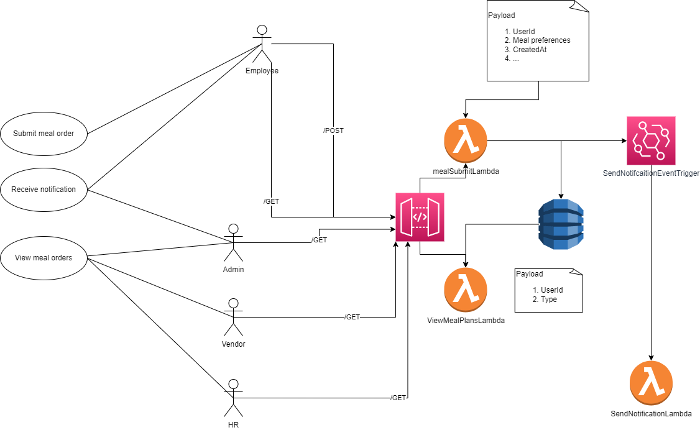
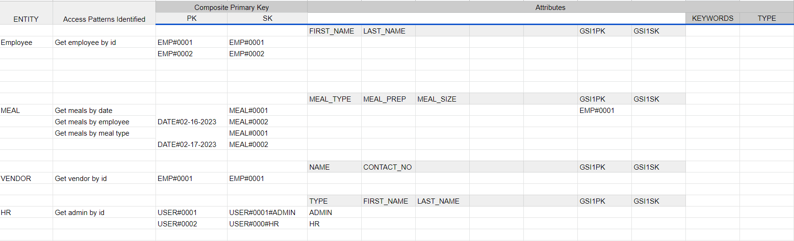

# Clean Architecture Workshop

This repository contains a backend created for given user story for a meal app built with AWS CDK, Lambda, DynamoDB, and API Gateway. Use ```npm install``` and ```npm run deploy``` to set up the necessary infrastructure.
# Use case diagram and the high level architecture diagram



# Single table design

